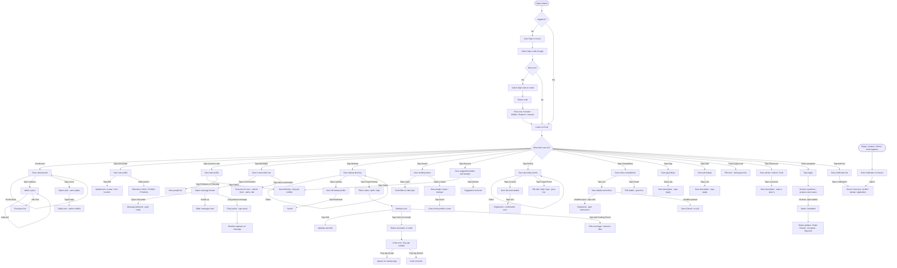

# Ments — User Flow (Click-by-Click)

```mermaid
flowchart TD
    A([Opens Ments]) --> B{Logged in?}
    B -- No --> C[Sees Sign In screen]
    C --> D[Clicks Sign in with Google]
    D --> E{New user?}
    E -- Yes --> F[Gets 6-digit code on email]
    F --> G[Enters code]
    G --> H[Picks role: Founder / Builder / Explorer / Investor]
    E -- No --> I
    H --> I[Lands on Feed]
    B -- Yes --> I

    I --> J{What does user do?}

    %% FEED
    J -- Scrolls feed --> K[Sees ranked posts]
    K -- Scrolls down --> K
    K -- Taps compose --> L[Writes a post]
    L -- Adds photo or video --> L
    L -- Adds poll --> L
    L -- Hits Post --> M[Post goes live]
    K -- Taps a post --> N[Opens post - sees replies]
    N -- Types reply --> O[Reply sent - author notified]

    %% PROFILE
    J -- Taps own avatar --> P[Sees own profile]
    P -- Taps Edit --> Q[Updates bio / avatar / role / location]
    P -- Adds section --> R[Education / Work / Portfolio / Positions]
    J -- Taps someone else --> S[Sees their profile]
    S -- Taps Follow --> T[Now following - they get notified]
    S -- Taps Followers or Following --> U[Sees people list]

    %% MESSAGES
    J -- Taps Messages --> V[Sees conversation list]
    V -- Taps a conversation --> W[Opens message thread]
    W -- Types and sends --> X[Message delivered - push notify]
    W -- Scrolls up --> Y[Older messages load]
    W -- Long presses message --> Z[Emoji picker - taps emoji]
    Z --> AA[Reaction appears on message]
    V -- Taps New conversation --> AB[Searches for user - selects them - starts chat]

    %% STARTUPS
    J -- Taps Startups --> AC[Sees startup directory]
    AC -- Filters --> AC
    AC -- Taps a startup --> AD[Sees full startup profile]
    AD -- Taps Bookmark --> AE[Saved]
    AC -- Taps Create Startup --> AF[Fills in name / pitch / logo]
    AF --> AG[Startup is live]
    AG -- Taps Edit --> AH[Updates any field]
    AG -- Taps Invite Co-founder --> AI[Enters username or email]
    AI --> AJ[Invite sent - they get notified]
    AJ -- They tap Accept --> AK[Appear on startup page]
    AJ -- They tap Decline --> AL[Invite removed]
    AG -- Taps Add Funding Round --> AM[Fills round type / amount / date]

    %% SEARCH
    J -- Taps Search --> AN[Sees trending topics]
    AN -- Taps a topic --> AO[Feed filters to that topic]
    AN -- Types a name --> AP[Sees people / posts / startups]
    AP -- Taps result --> AQ[Goes to that profile or post]
    J -- Taps Discover --> AR[Sees suggested people and startups]
    AR -- Taps Follow --> T
    AR -- Taps Dismiss --> AS[Suggestion removed]

    %% EVENTS
    J -- Taps Events --> AT[Sees upcoming events]
    AT -- Filters --> AT
    AT -- Taps an event --> AU[Sees full event details]
    AU -- Taps Join --> AV[Registered - confirmation sent]
    AT -- Taps Create Event --> AW[Fills title / date / type - goes live]

    %% COMPETITIONS
    J -- Taps Competitions --> AX[Sees active competitions]
    AX -- Taps one --> AY[Sees details and entries]
    AY -- Deadline open - taps Join --> AZ[Registered - gets instructions]
    AY -- Deadline passed --> BA[Sees Closed - no join]
    AX -- Taps Create --> BB[Fills details - goes live]

    %% GIGS & JOBS
    J -- Taps Gigs --> BC[Sees gig listings]
    BC -- Taps a gig --> BD[Sees description - taps Apply]
    J -- Taps Jobs --> BE[Sees job listings]
    BE -- Taps a job --> BF[Sees description - taps Apply]
    J -- Posts a gig or job --> BG[Fills form - listing goes live]

    %% RESOURCES
    J -- Taps Resources --> BH[Sees articles / videos / tools]
    BH -- Taps a resource --> BI[Sees description - taps to open it]

    %% APPLICATIONS
    J -- Finds a program --> BJ[Taps Apply]
    BJ --> BK[Answers questions - progress auto-saves]
    BK -- All done - taps Submit --> BL[Status: Submitted]
    BL --> BM[Status updates: Under Review - Accepted - Rejected]

    %% NOTIFICATIONS
    J -- Taps bell icon --> BN[Sees notification list]
    BN -- Taps a notification --> BO[Goes to that post / profile / startup / application]
    BP([Reply / mention / follow / invite happens]) --> BQ[Push notification on device]
    BQ -- Taps it --> BO
```
