# Ments — Full User Flow (Mermaid)

> To use with [mermaid.live](https://mermaid.live), paste only the content inside a single code block (without the triple backticks).

---

## 1. Top-Level App Entry

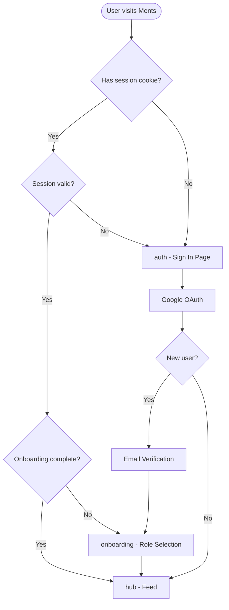

---

## 2. Auth & Onboarding

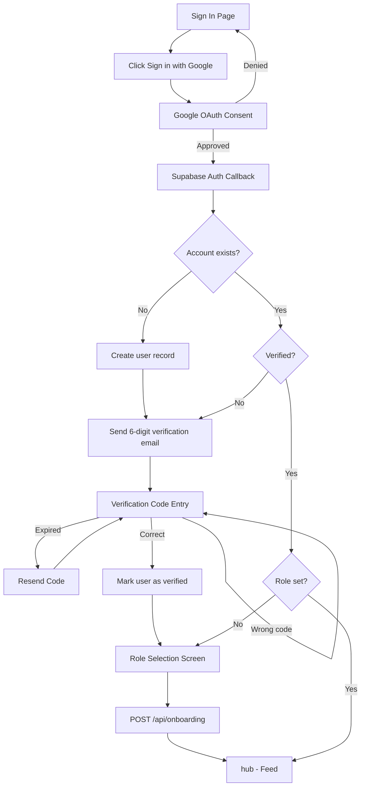

---

## 3. Feed & Posts

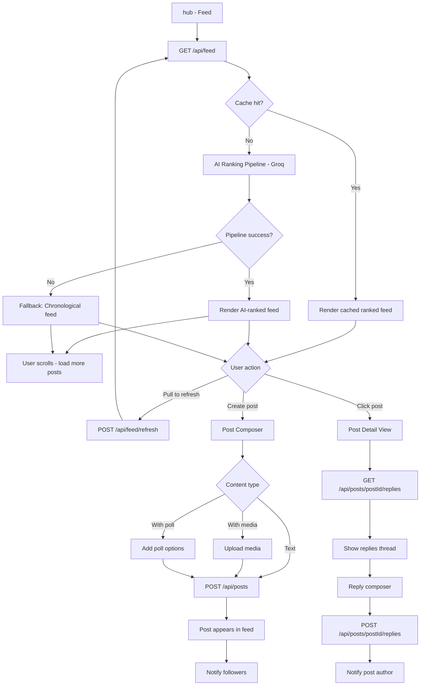

---

## 4. User Profile

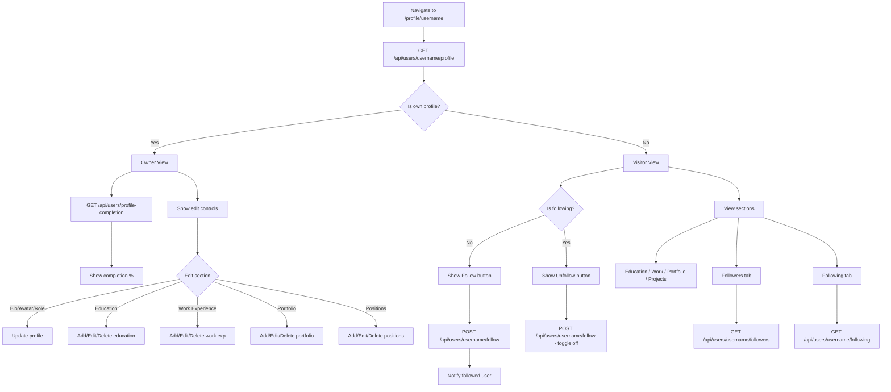

---

## 5. Messaging

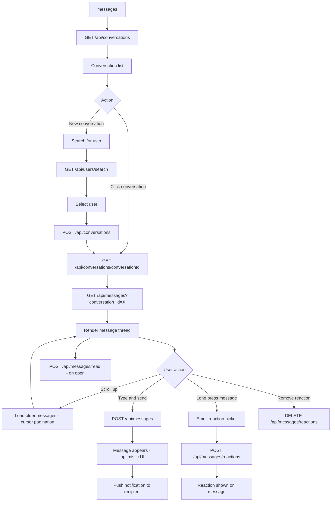

---

## 6. Startups

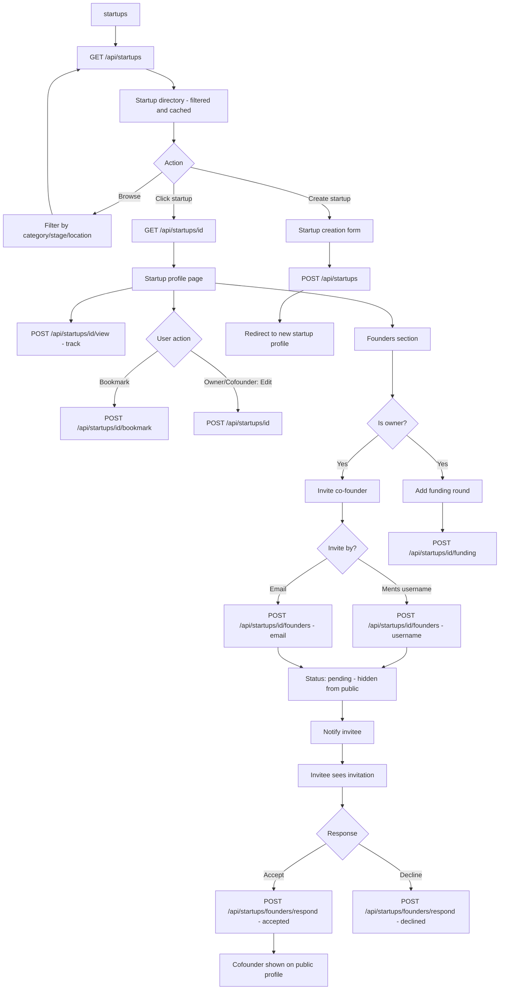

---

## 7. Discovery and Search

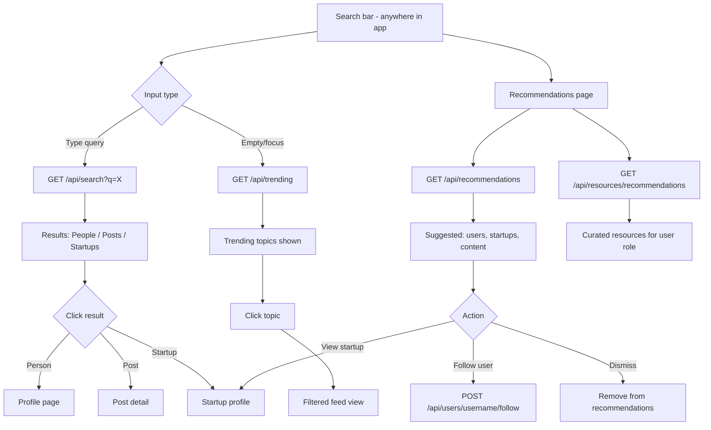

---

## 8. Events

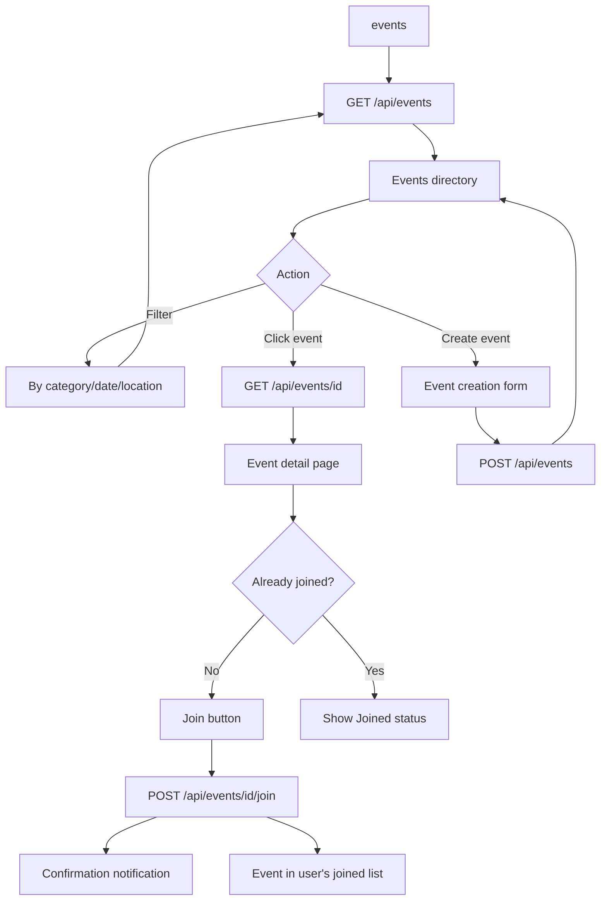

---

## 9. Competitions

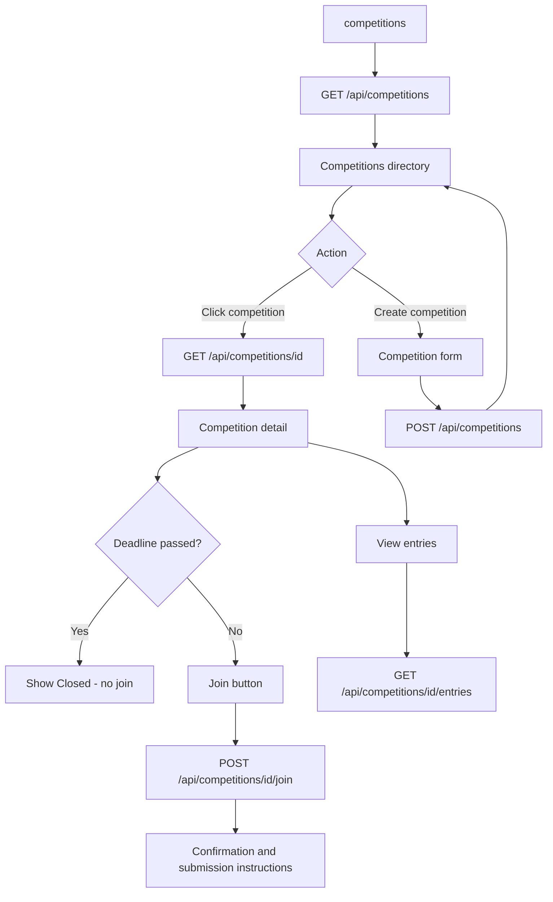

---

## 10. Gigs and Jobs

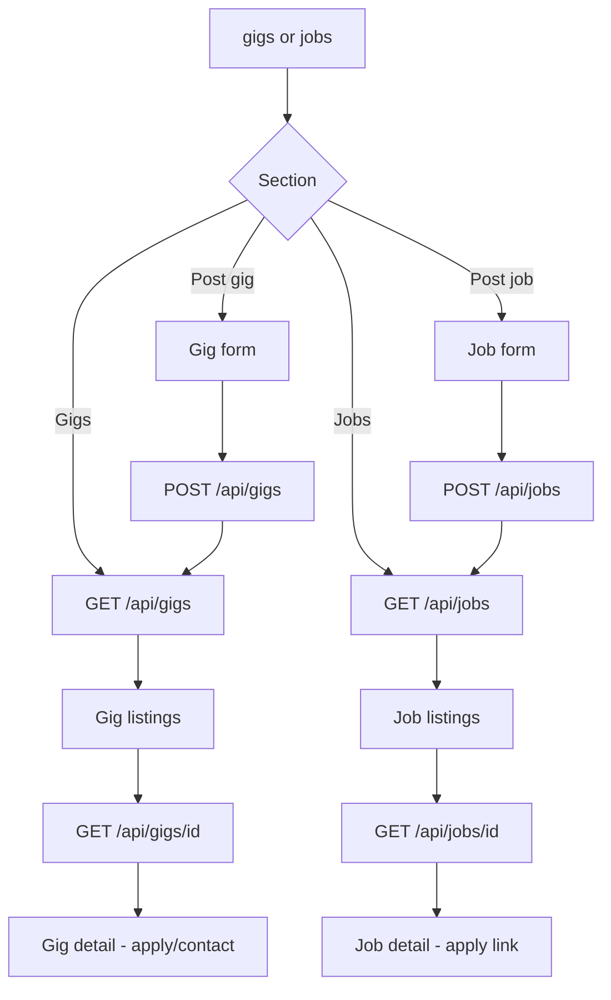

---

## 11. Applications

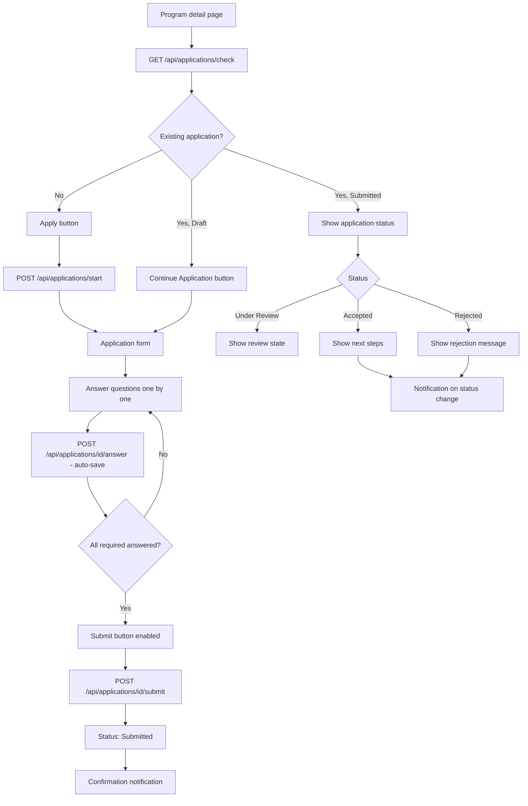

---

## 12. Notifications

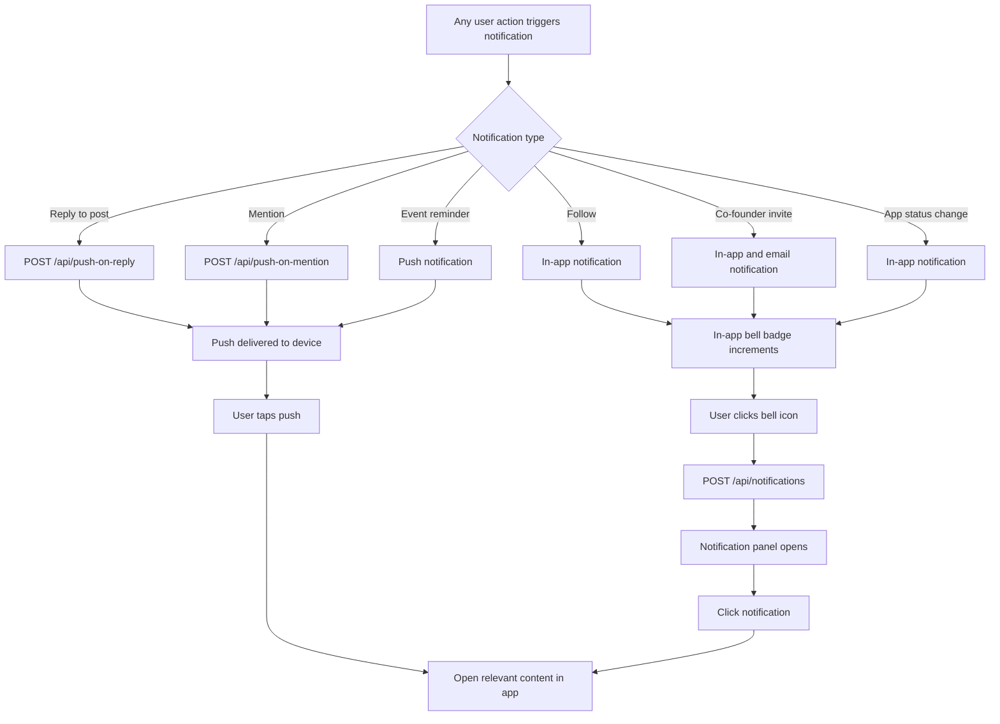
