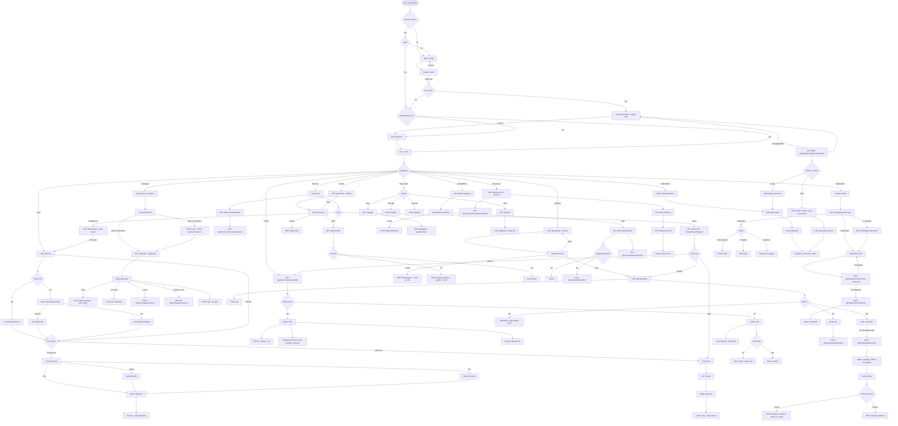

# Ments — Single Complete User Flow

> Paste everything inside the code block into [mermaid.live](https://mermaid.live)

```mermaid
flowchart TD
    %% ── ENTRY ──────────────────────────────────────────────
    START([User visits Ments]) --> SC{Session cookie?}
    SC -- No --> AUTH["Sign In Page"]
    SC -- Yes --> SV{Valid?}
    SV -- No --> AUTH
    SV -- Yes --> OB{Onboarding done?}

    AUTH --> OAUTH[Google OAuth]
    OAUTH -- Denied --> AUTH
    OAUTH -- Approved --> NEW{New user?}
    NEW -- Yes --> VER[Email Verification - 6-digit code]
    VER -- Wrong/Expired --> VER
    VER -- Correct --> ROLE[Role Selection]
    ROLE --> FEED
    NEW -- No --> OB
    OB -- No --> ROLE
    OB -- Yes --> FEED

    %% ── MAIN HUB ────────────────────────────────────────────
    FEED["hub - Feed"]
    FEED --> NAV{Navigate to}

    NAV -- Feed --> FE1["GET /api/feed"]
    NAV -- Profile --> PR1
    NAV -- Messages --> MSG1
    NAV -- Startups --> ST1
    NAV -- Discover --> DIS1
    NAV -- Events --> EV1
    NAV -- Competitions --> CO1
    NAV -- "Gigs / Jobs" --> GJ1
    NAV -- Resources --> RES1
    NAV -- Applications --> AP1
    NAV -- Notifications --> NOT1

    %% ── FEED ────────────────────────────────────────────────
    FE1 --> FE2{Cache hit?}
    FE2 -- Yes --> FE3[Cached ranked feed]
    FE2 -- No --> FE4[Groq AI Ranking Pipeline]
    FE4 -- Success --> FE5[AI-ranked feed]
    FE4 -- Fail --> FE6[Chronological fallback]
    FE3 & FE5 & FE6 --> FE7{User action}
    FE7 -- Refresh --> FE1
    FE7 -- Create post --> FE8[Post Composer]
    FE8 -- Text --> FE9["POST /api/posts"]
    FE8 -- Media --> FE10[Upload media] --> FE9
    FE8 -- Poll --> FE11[Add poll options] --> FE9
    FE9 --> FE12[Post live - notify followers]
    FE7 -- Click post --> FE13[Post Detail]
    FE13 --> FE14["GET replies"]
    FE14 --> FE15[Reply composer]
    FE15 --> FE16["POST reply - notify author"]

    %% ── PROFILE ─────────────────────────────────────────────
    PR1["GET /api/users/username/profile"] --> PR2{Own profile?}
    PR2 -- Yes --> PR3[Owner View]
    PR3 --> PR4[Edit bio / avatar / role]
    PR3 --> PR5["Add/edit education, work, portfolio, positions"]
    PR3 --> PR6["Profile completion %"]
    PR2 -- No --> PR7[Visitor View]
    PR7 --> PR8{Following?}
    PR8 -- No --> PR9["POST follow - notify user"]
    PR8 -- Yes --> PR10["POST unfollow"]
    PR7 --> PR11[View followers / following]

    %% ── MESSAGING ───────────────────────────────────────────
    MSG1["GET /api/conversations"] --> MSG2[Conversation list]
    MSG2 -- Click conversation --> MSG3["GET messages - paginated"]
    MSG3 --> MSG4[Message thread]
    MSG4 -- Send --> MSG5["POST /api/messages - push notify"]
    MSG4 -- Scroll up --> MSG6[Load older messages]
    MSG4 -- React --> MSG7["POST /api/messages/reactions"]
    MSG4 -- Remove react --> MSG8["DELETE /api/messages/reactions"]
    MSG4 --> MSG9["POST read - on open"]
    MSG2 -- New conversation --> MSG10["Search user - POST /api/conversations"]
    MSG10 --> MSG3

    %% ── STARTUPS ────────────────────────────────────────────
    ST1["GET /api/startups - cached"] --> ST2[Startup directory]
    ST2 -- Filter --> ST1
    ST2 -- Click --> ST3["GET /api/startups/id"]
    ST3 --> ST4[Track view]
    ST3 --> ST5{Owner?}
    ST5 -- Yes --> ST6["Edit profile / add funding round"]
    ST5 -- Yes --> ST7[Invite co-founder]
    ST7 -- By username/email --> ST8["POST /api/startups/id/founders"]
    ST8 --> ST9["Status: pending - hidden from public"]
    ST9 --> ST10[Notify invitee]
    ST10 --> ST11{Invitee response}
    ST11 -- Accept --> ST12["POST respond: accepted - shown on profile"]
    ST11 -- Decline --> ST13["POST respond: declined"]
    ST5 -- No --> ST14[Bookmark]
    ST14 --> ST15["POST /api/startups/id/bookmark"]
    ST2 -- Create --> ST16["POST /api/startups - create profile"]

    %% ── DISCOVERY ───────────────────────────────────────────
    DIS1[Search bar] --> DIS2{Input}
    DIS2 -- Query --> DIS3["GET /api/search - People/Posts/Startups"]
    DIS3 --> DIS4{Click result}
    DIS4 -- Person --> PR1
    DIS4 -- Startup --> ST3
    DIS4 -- Post --> FE13
    DIS2 -- Empty/focus --> DIS5["GET /api/trending - show topics"]
    DIS5 -- Click topic --> FE1
    DIS1 --> DIS6["GET /api/recommendations"]
    DIS6 --> DIS7["GET /api/resources/recommendations"]

    %% ── EVENTS ──────────────────────────────────────────────
    EV1["GET /api/events - cached"] --> EV2[Events directory]
    EV2 -- Filter --> EV1
    EV2 -- Click --> EV3["GET /api/events/id"]
    EV3 --> EV4{Joined?}
    EV4 -- No --> EV5["POST /api/events/id/join - confirm + notify"]
    EV4 -- Yes --> EV6[Joined status]
    EV2 -- Create --> EV7["POST /api/events"]

    %% ── COMPETITIONS ────────────────────────────────────────
    CO1["GET /api/competitions"] --> CO2[Competitions directory]
    CO2 -- Click --> CO3["GET /api/competitions/id"]
    CO3 --> CO4{Deadline passed?}
    CO4 -- Yes --> CO5[Closed]
    CO4 -- No --> CO6["POST /api/competitions/id/join"]
    CO3 --> CO7["GET /api/competitions/id/entries"]
    CO2 -- Create --> CO8["POST /api/competitions"]

    %% ── GIGS & JOBS ─────────────────────────────────────────
    GJ1{Section} -- Gigs --> GJ2["GET /api/gigs"]
    GJ1 -- Jobs --> GJ3["GET /api/jobs"]
    GJ2 --> GJ4["GET /api/gigs/id - apply/contact"]
    GJ3 --> GJ5["GET /api/jobs/id - apply link"]
    GJ1 -- Post gig --> GJ6["POST /api/gigs"]
    GJ1 -- Post job --> GJ7["POST /api/jobs"]

    %% ── RESOURCES ───────────────────────────────────────────
    RES1["GET /api/resources - cached"] --> RES2[Resources directory]
    RES2 --> RES3["GET /api/resources/id"]
    RES3 --> RES4[Open resource URL]
    RES1 --> RES5["GET /api/resources/recommendations"]

    %% ── APPLICATIONS ────────────────────────────────────────
    AP1[Program detail] --> AP2["GET /api/applications/check"]
    AP2 -- "No existing" --> AP3["POST /api/applications/start"]
    AP2 -- "Draft exists" --> AP4[Application form]
    AP3 --> AP4
    AP4 --> AP5["POST /api/applications/id/answer - auto-save"]
    AP5 -- "Incomplete" --> AP4
    AP5 -- "All answered" --> AP6["POST /api/applications/id/submit"]
    AP6 --> AP7[Status: Submitted]
    AP2 -- "Submitted" --> AP8{Status}
    AP8 -- "Under Review" --> AP9[Review state]
    AP8 -- Accepted --> AP10[Next steps]
    AP8 -- Rejected --> AP11[Rejection message]

    %% ── NOTIFICATIONS ───────────────────────────────────────
    NOT1["POST /api/notifications"] --> NOT2[Notification panel]
    NOT2 --> NOT3[Click notification]
    NOT3 --> NOT4[Navigate to relevant content]
    PUSHEV["Any trigger: reply/mention/follow/invite/status"] --> NOT5{Push or in-app?}
    NOT5 -- Push --> NOT6["POST push-on-reply / push-on-mention"]
    NOT6 --> NOT7[Push delivered to device]
    NOT5 -- In-app --> NOT8[Bell badge increments]
    NOT7 --> NOT4
    NOT8 --> NOT2
```
